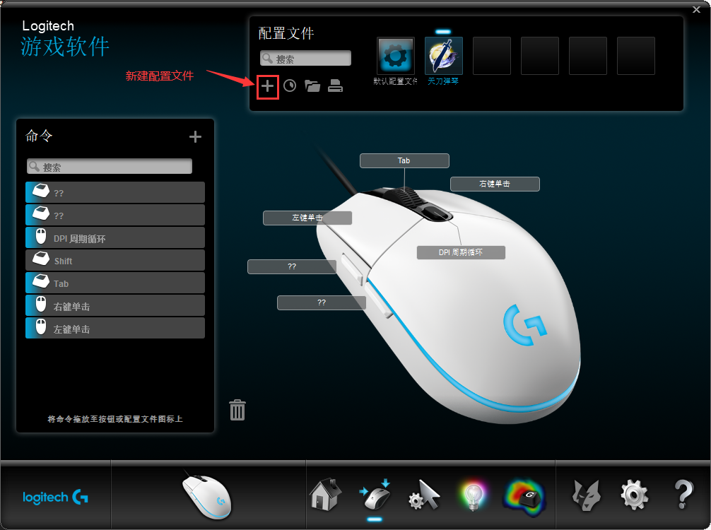
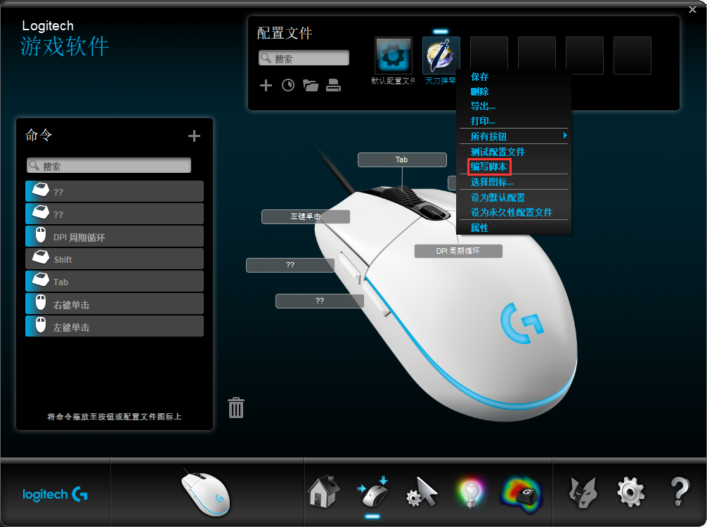
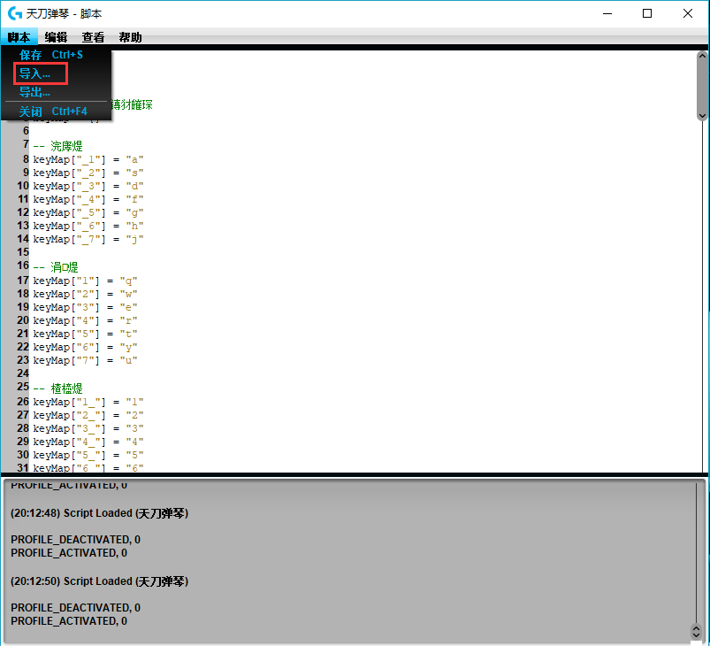

# 天涯明月刀罗技鼠标弹奏脚本
> 该脚本是天涯明月刀罗技G系列鼠标自动弹琴脚本，使用lua脚本编写。本人使用的鼠标为G102

## 一、前提条件

 当然了，你需要拥有一个G系列的罗技鼠标，具有宏编程的功能。


## 二、原理
通过lua宏编程模拟键盘输入，根据音符。仔细说就是，通过录入去曲谱，根据唱名(1234567)，匹配自由弹奏中对应的键位，然后模拟按键输入。

## 三、脚本使用方法
### 第一步：为鼠标创建天刀专属配置文件

> 打开罗技鼠标配置软件，创建专属的配置文件是为了方便管理和切换，避免和其他游戏或者软件的配置文件冲突




> 选择天涯明月刀的启动程序


### 第二步：导入自动弹奏脚本
1. 在系统盘除外的任意盘创建`WuxiaPlayMusic`文件夹
2. 在`WuxiaPlayMusic`文件夹下新建`wuxia_play_music.lua`，`wuxia_play_music.lua`可以从文章最后那里复制粘贴到里面，也可以戳这里直接下载 [源码](https://slgluo.coding.net/p/WuxiaPlayMusic/d/WuxiaPlayMusic/git)
3. 指定脚本路径。在`wuxia_play_music.lua`中找到以下代码，修改为`WuxiaPlayMusic`文件夹的路径

``` lua
-- 脚本路径，注意斜杠方向
scriptDir = "E:/WuxiaPlayMusic"
```


4. 选择刚才在==罗技鼠标配置软件==创建的配置，右键，选择==编写脚本==



5. 导入自动弹奏脚本 `wuxia_play_music.lua`




### 第三步：使用曲谱
1. 在`WuxiaPlayMusic`文件夹中创建`songs`文件夹

2. 在 `songs`文件夹下放入曲谱。[曲谱戳这里下载（在 `songs` 文件夹中）](https://slgluo.coding.net/p/WuxiaPlayMusic/d/WuxiaPlayMusic/git)

目前有《Love Story》、《卡农》、《我的一个道姑朋友》、《晴天》和《贝加尔湖畔》，持续更新增加中...


### 第四步，自动弹奏
启动游戏，进入自由弹奏模式，按下==鼠标中键滚轮键==，开始弹奏。按`ScrLk`停止，按`Caps`下一首

## 四、编写曲谱
### 1. 编写曲谱
 新建后缀名为`lua`的文件，除中文和特殊字符外，文件名随便取，并按以下格式进行编写：

``` lua
-- 卡农曲谱
local source = {}

-- 一分钟80拍，控制弹奏速度
source["bpm"] = 80
	
-- beat_n一个小节有n拍，
source["beat_n"] = 4
	
-- beat_m分音符为一拍
source["beat_m"] = 4

local chords = source["chords"]

source["music"] = {}
music = source["music"]

-- rc:唱名,音高（选填）。可以在这个地方编写旋律音，也可以不写，代替的方式是旋律音也写在chord中
-- note:代表时值（必填），如4分音符，8分音符
-- chord: 和音（选填），即大家所说的双键，rc和chord会同时按下。旋律音也可以写到这里
chapter = {
    -- 三个参数都填
    {["rc"] = "3_", ["note"] = 4, ["chord"] = "1,5,1_"},
    -- 效果和上面一样
    {["note"] = 4, ["chord"] = "1,5,1_,3_"},
        
    -- 休止符等不弹的情况
    {["rc"] = "-", ["note"] = 4},
    -- 效果和上面一样
    {["note"] = 4},
		...
}
table.insert(music, chapter)

return source
```
**参数说明：**

* `bpm`：（必填）控制弹奏速度
* `beat_n`：（必填）一个小节的拍数，一般在歌谱左上角标有，如4/4，`beat_n`取分子
* `beat_m`：（必填）多少分音符为一拍，一般在歌谱左上角标有，如4/4，`beat_m`取分母
* `rc`：（选填）旋律音符，为单音，也可以不写，代替的方式是旋律音也写在`chord`中。如果遇到附点音符、延音符、休止符都可以用`0`或`-`代替，表示不弹，但是时值一定要对。因为在自由弹奏中是没有延音的，无论按多久。
* `note`：（必填）音符时值，如4分音符，8分音符
* `chord`：（选填）和音，即所谓的双键音。旋律音也可以写到这里，二选一。
* 高中低音：_ 下划线开头为低音，无前后缀为中音，_ 下划线结尾为高音

**注意事项：**

由于天崖明月刀自由弹奏的音阶只有高中低的`1234567`，没有`#`（升高一个半音）和`b`（降低一个半音），所以只能弹奏C大调和a小调的歌曲。

## 源码

``` lua
-- 模式
debug = true

-- 歌单
-- 要和歌谱文件名一样
songList = {
    "ka_nong",
    "love_story",
    "qing_tian",
    "bei_jia_er_hu_pan",
    "dao_gu_peng_you",
}

-- 已加载的歌曲列表
loadedSongList = {}

-- 唱名键盘映射表
keyMap = {}

-- 低音
keyMap["_1"] = "a"
keyMap["_2"] = "s"
keyMap["_3"] = "d"
keyMap["_4"] = "f"
keyMap["_5"] = "g"
keyMap["_6"] = "h"
keyMap["_7"] = "j"

-- 中音
keyMap["1"] = "q"
keyMap["2"] = "w"
keyMap["3"] = "e"
keyMap["4"] = "r"
keyMap["5"] = "t"
keyMap["6"] = "y"
keyMap["7"] = "u"

-- 高音
keyMap["1_"] = "1"
keyMap["2_"] = "2"
keyMap["3_"] = "3"
keyMap["4_"] = "4"
keyMap["5_"] = "5"
keyMap["6_"] = "6"
keyMap["7_"] = "7"

----------------------- 键位 ---------------------------
--开始和停止的键，

-- 键位: 只能是numlock,scrolllock,capslock
modifierBtn = {
    -- 停止键
    ["stop"] = "scrolllock",
    -- 下一首
    ["next"] = "capslock"
}
-- 开始键，中键
mouseBtn = {
    ["start"] = 3
}
StartKey = 3


--------------------------------------------------------

-- 是否正在弹奏
isPlay = false

-- 脚本位置
scriptDir = "E:/WuxiaPlayMusic"
-- 歌单文件夹
songsDir = "/songs"
-- 歌单存储的路径
songListPath = scriptDir..songsDir

currentIndex = -1


----------------------------------------------------------------------------
--------------------------------工具函数------------------------------------
----------------------------------------------------------------------------
-- 字符串分割
function split(str,delimiter)
    local dLen = string.len(delimiter)
    if type(str) == "nil" then
        return
    end
    local newDeli = ''
    for i=1,dLen,1 do
        newDeli = newDeli .. "["..string.sub(delimiter,i,i).."]"
    end

    local locaStart,locaEnd = string.find(str,newDeli)
    local arr = {}
    local n = 1
    while locaStart ~= nil
    do
        if locaStart>0 then
            arr[n] = string.sub(str,1,locaStart-1)
            n = n + 1
        end

        str = string.sub(str,locaEnd+1,string.len(str))
        locaStart,locaEnd = string.find(str,newDeli)
    end
    if str ~= nil then
        arr[n] = str
    end
    return arr
end

-- 获取表长度
function table_leng(t)
    local leng=0
    for k, v in pairs(t) do
      leng=leng+1
    end
    return leng;
end

-- 从和弦中获取在键盘中对应的键位
function getKeysFromChord(chord)
    -- 得多和弦的组成音
    local chord_rcs = split(chord, ",")
    local keys = {}
    if(not chord_rcs) then
        return
    end
    for i, rc in ipairs(chord_rcs) do
        table.insert(keys, keyMap[rc])
    end
    return keys
end
-----------------------------------------------------------------------------


----------------------------------------------------------------------------
------------------------------ 弹奏相关函数----------------------------------
----------------------------------------------------------------------------
-- 开始弹奏
function play(music)
    isPlay = true
	local m = music["music"]
	for i, chapter in ipairs(m) do
		OutputLogMessage("...chapter_%d start...\n",i)
		-- roll_call唱名，note音符，如八分音符
        for i, note in ipairs(chapter) do
            if(IsKeyLockOn(modifierBtn.stop) == false) then
                if(IsKeyLockOn("scrolllock")) then
                    PressAndReleaseKey("scrolllock")
                end
                return "stop"
            elseif(IsKeyLockOn(modifierBtn.next) and isPlay == true) then
                -- 有时候关不掉，关掉再结束协程
                while(IsKeyLockOn(modifierBtn.next)) do
                    OutputLogMessage("modifierBtn.next is on\n")
                    PressAndReleaseKey(modifierBtn.next)
                    Sleep(50)
                end
                isPlay = false
                Sleep(2000)
                return "next"
            end
            -- 旋律音对应的键
            local key = keyMap[note["rc"]]
            -- 和弦
            local chord = note["chord"]
            -- 和弦对应的键位
            local keys = getKeysFromChord(chord)
			-- 时值
			local time = (60 * 1000 / music["bpm"]) / (note["note"] / music["beat_m"])
            if type(key) == "nil" then
                if type(note["rc"]) ~= "nil" then
                    OutputLogMessage("rc:%s, key:nil, ", note["rc"], key)
                end
				OutputLogMessage("time:%.1f, ", time)
                if type(chord) ~= "nil" then
                    OutputLogMessage("chord:%s ", chord)
                    PressAndReleaseKey(unpack(keys))
                end
                Sleep(time)
			else
				OutputLogMessage("rc:%s, key:%s, ", note["rc"], key)
                OutputLogMessage("time:%.1f, ", time)
                -- 如果存在和音，则加人和音
                if type(chord) ~= "nil" then
                    OutputLogMessage("chord:%s ", chord)
                    -- 如果和弦音中已经存在旋律音，直接弹和弦音。否则，将旋律音加人
                    table.insert(keys, key)
                    PressKey(unpack(keys))
                    Sleep(time)
                    ReleaseKey(unpack(keys))
                else            
                    PressKey(key)
                    Sleep(time)
                    ReleaseKey(key)
                end

            end
            chord = nil
            OutputLogMessage("\n",i)
        end
		OutputLogMessage("...chapter_%d end...\n",i)
    end
    stop()
end

function start(song)
    if(type(song["song"]) == "nil") then
        OutputLogMessage("在songs文件夹中没有这首曲谱，或曲谱格式错误\n")
        next()
        return
    end
    OutputLogMessage("start %s\n", song["name"])

    local playThread = coroutine.create(play)
    local status, playStatus = coroutine.resume(playThread, song["song"])
    if(status) then
        if(playStatus == "stop") then
            isPlay = false
            currentIndex = -1
            OutputLogMessage("stop play\n")
        elseif(playStatus == "next") then
            next()
        elseif(playStatus == "prev") then
            prev()
        end
    end
end

-- 下一首
function next()
    OutputLogMessage("next\n")
    -- 第一次默认弹奏第一首
    local song = nil

    if(currentIndex == table_leng(loadedSongList)) then
        currentIndex = 1
    else    
        currentIndex = currentIndex + 1
    end
    song = loadSong(currentIndex)
    start(song)
end

-- 上一首
function prev()
    OutputLogMessage("prev\n")
    -- 第一次默认弹奏第一首
    local song = nil
    if(currentIndex == 1) then
        local songSize = table_leng(loadedSongList)
        currentIndex = songSize
    else
        currentIndex = currentIndex - 1
    end
    song = loadSong(currentIndex)
    start(song)
end


-- 加载歌曲
function loadSong(index)
    local songSize = table_leng(songList)
    if(index >= 1 and index <= songSize) then
        return loadedSongList[index]
    end
end

-- 加载歌单
function loadSongList()
    for index, songFileName in ipairs(songList) do
        local songPath = songListPath.."/"..songFileName..".lua"
        local getSong =  loadfile(songPath)
        if(type(getSong) == "nil") then
            OutputLogMessage("%s not found in \'songs\' folder or format error\n", songFileName)
        else
            OutputLogMessage("%s loaded\n", songFileName)
            table.insert(loadedSongList, {["name"] = songFileName, ["song"] = getSong()})
        end
    end
end

-------------------------------------------------------------------------------


------------------------------------------------------------------------------
-------------------------------框架代码----------------------------------------
-------------------------------------------------------------------------------

bEnable = false

function OnEvent(event, arg)
    OutputLogMessage("%s, %d\n", event, arg)
    if(event == "PROFILE_ACTIVATED" and arg == 0) then
        loadSongList()
    elseif(event == "MOUSE_BUTTON_PRESSED" and bEnable == false and IsKeyLockOn(modifierBtn.stop) == false) then
        bEnable = true
        if(arg == mouseBtn.start) then
            PressAndReleaseKey(modifierBtn.stop)
            Sleep(20)
            if(not isPlay) then
                if(currentIndex == -1) then
                    currentIndex = 1
                    start(loadSong(currentIndex))
                end
            end
        end
        bEnable = false
    end
end
-------------------------------------------------------------------------


---------------------- debug code ---------------------------------------
-- ---------------使用时，需要注释以下代码
-------------------------------------------------------------------------

-- function OutputLogMessage(formatMsg, ...)
--     print(string.format(formatMsg, ...))
-- end

-- function PressKey(...)
--     for i, v in ipairs({...}) do
--         OutputLogMessage("%s was pressed", v)
--     end
-- end

-- function ReleaseKey(...)
--     for i, v in ipairs({...}) do
--         OutputLogMessage("%s was released", v)
--     end
-- end

-- function PressAndReleaseKey(...)
--     for i, v in ipairs({...}) do
--         OutputLogMessage("%s was pressed and released", v)
--     end
-- end

-- function IsMouseButtonPressed(key)
--     OutputLogMessage("%s IsMouseButtonPressed", v)
--     return true
-- end

-- function IsKeyLockOn(key)
--     return false
-- end

-- function Sleep(time)
--     OutputLogMessage("sleep %.1f", time)
-- end

-- OnEvent("PROFILE_ACTIVATED", 0)
--OnEvent("MOUSE_BUTTON_PRESSED", StartKey)


```

[源代码戳这里](https://slgluo.coding.net/p/WuxiaPlayMusic/d/WuxiaPlayMusic/git)